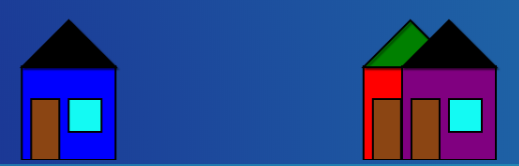
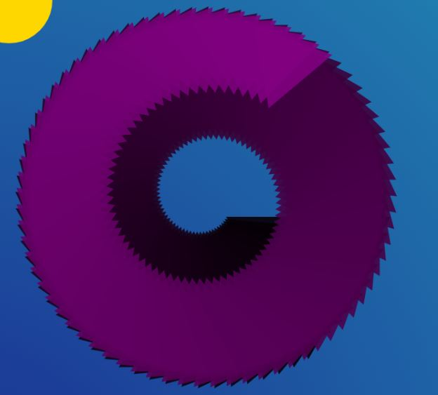
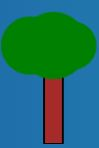

## Générateur de paysages virtuels 

Projet de développement logiciel à destinatation d'apprentis développeur.
Les membres du groupe sont Louis Fortrie, Clément Detruiseux, Jeremie Barrière et Mathéo Delenin
### Analyse du code

#### index.html

La barre de menu contient une liste déroulante présentant les composants de forme

```html
  <li><a class="hsubs" href="#">Composant</a>
      <ul class="subs">
        <li><a href="#" onclick="drawForm('Maison');return false;">Maison</a></li>
                <li><a href="#" onclick="drawForm('Cercle');return false;">Cercle</a></li>
                <li><a href="#" onclick="drawForm('Arbre');return false;">Arbre</a></li>
                <li><a href="#" onclick="drawForm('Spiral');return false;">Spiral</a></li>
      </ul>
  </li>
```

Un clic utilisateur sur un des items de cette liste provoquera 
un appel à la fonction `drawForm`.

```javascript
<script type="module" src="js/main.js"></script>

<script>
  function drawForm(form) {
    document.drawForm(form)
  }
</script>

``` 
En allant voir  `main.js` on comprend que la fonction `drawForm` 
est une référence la fonction  `drawThisForm` du module `main.js` (importé juste avant)
  


###Créer un nouveau type d'objet
Afin de pouvoir créer un nouvel objet, il faut d'abord créer le fichier lui correspondant, c'est dans ce fichier que l'on va définir ses caractéristiques (variables). On va ici prendre le fichier `Arbre.js` comme exemple. En premier lieu nous importons les différentes classes dont nous avons besoins. 
Pour notre arbre, nous avons besoins d'un rectangle (que l'on peut créer grâce à la classe `{Cube}` ) et des cercles (que l'on peut créer a partir de la classe `{Sun}` )

```javascript
import { AbstractForm } from './AbstractForm.js';
import { Cercle } from './Cercle.js';
import { Rectangle } from './Rectangle.js'
```
Nous définissons ensuite les différentes variables de notre nouvelle classe `Arbre`.
Puisque notre classe `Arbre` hérite de notre classe `AbstractForm`, on doit définir toutes les variables de `AbstractForm` et les variables spécifiques à notre classe `Arbre`. Ici, la variable cercle n'existe pas dans `AbstractForm`, nous la définissons donc dans notre constructeur et grâce à la ligne `this.cercle = cercle`, cercle étant ici un tableau.

```javascript
class Arbre extends  AbstractForm {
  // you create new Rectangles by calling this as a function
  // these are the arguments you pass in
  // add default values to avoid errors on empty arguments
  constructor (
      x = 0,
      y = 0,
      width = 0,
      height = 0,
      fillColor = '',
      strokeColor = '',
      strokeWidth = 2,
      pesenteur= false,
      cercles = []

    ) {
      super(x,y,width, height, fillColor, strokeColor, strokeWidth, pesenteur)
      this.cercles = cercles

    }

```
Nous devons ensuite créer la fonction `draw()`. Cette fonction est la fonction permettant de dessiner les objets que nous définissons.
```javascript
draw (ctx) {
    ctx.save()
    // set the styles for this shape
    ctx.fillStyle = this.fillColor
    ctx.lineWidth = this.strokeWidth

    // create the *path*
    ctx.beginPath()
    ctx.strokeStyle = this.strokeColor

    const MAX_HEAD = 80
    let new_y = (this.pesanteur) ? window.innerHeight - this.height - MAX_HEAD: this.y

    ctx.rect(this.x, new_y, this.width, this.height)
    // draw the path to screen
    ctx.fill()
    ctx.stroke()


    ctx.restore()
```
L'expression `ctx.rect` permet de définir notre objet comme un rectangle, puis de définir ses variables 'géométrique' (`x` et `y` sont ses coordonnées selon le repère cartésiens dont l'origine est le coin en haut à gauche de la fenêtre  , `this.width` et `this.height` étant sa largeur et sa hauteur en pixel).
```javascript
//Cercle
    if (this.cercles.length > 0) {
        for (let j = 0; j < this.cercles.length; j++) {
            if (this.cercles.length[j]==0){
            this.cercles[j].y = new_y - this.height+60
        }
        else if (this.cercles.length==1){
            this.cercles[j].y = new_y - this.height+35
        }
        else if (this.cercles.length==1){
            this.cercles[j].y = new_y - this.height+35
        }
         else {
            this.cercles[j].y = new_y - this.height+45
        }
         this.cercles[j].draw(ctx)
            }
        }
```
Cet extrait de code nous permet de dessiner d'autres formes n'étant pas notre forme principales (ici les cercles sont les feuilles reposant sur le tronc, notre forme principales).
Puisque notre variables cercle est un tableau, nous devons donc faire un boucle afin de le parcourir.
La prochaine étape est la définition des variables de nos objet

```javascript
arbre1() {
   let x=Math.random()*1200
    const arbre1 = new Arbre(x, 0, 20, 75, 'brown', '', 2, true, [new Cercle(x-15, 850, 30, 0, 2*Math.PI, 'green', 'green', 2, false), new Cercle(x, 820, 25, 0, 2*Math.PI, 'green', 'green', 2, false),new Cercle(x+10, 830, 35, 0, 2*Math.PI, 'green', 'green', 2, false), new Cercle(x+15, 820, 25, 0, 2*Math.PI, 'green', 'green', 2, false),new Cercle(x+30, 840, 25, 0, 2*Math.PI, 'green', 'green', 2, false)])
    return arbre1
    }
```
On définit la variable x grâce à l'aléatoire, puis nous déterminons toutes nos variables en appelant la classe `{Cube}` (puis la classe Sun afin de déterminer les variables des cercles). 
On retourne ensuite arbre1, notre premier objet.
```javascript
static buildForms() {
   const foret = new Arbre()
   let forms = []
   forms.push(foret.arbre1())
   const builds = forms
   return builds
   }

}

export { Arbre }

```
Le `buildForms()` est une fonctions utilisé plus tard dans le code, qui nous permet de transmettre nos objet de notre page Arbre à la fonctions permettant de dessiner nos objet. Ils ne nous reste plus qu'a exporter notre classe `{Arbre}` et nous pouvons passer à la page suivante.
### ajouter/supprimer une nouvelle classe de forme

Une fois le fichier comportant la nouvelle Classe créer, il faut importer les classes dont on va avoir besoin, grâce au code ci dessous :
```javascript
    import {Maison} from './modules/Maison.js';
    import {Cercle} from './modules/Cercle.js';
    import {Arbre} from './modules/Arbre.js';
    import {Spiral} from './modules/Spiral.js';
```
Il faut ensuite modifier le fichier `main.js` afin de permettre de dessiner les nouvelles formes.
Dans un premier temps, on complète la fonction `buildForms()` pour chaqu'une de nos classes


```javascript
    
 /**
  * construit les différentes formes du paysage, en appelant la méthode statique
  * buildForms de chacune des classes
  *
  * @return {Object[]}
  */
 function buildForms() {
     let forms = Maison.buildForms()
     forms = forms.concat(Cercle.buildForms())
     forms = forms.concat(Arbre.buildForms())
     forms = forms.concat(Spiral.buildForms())
```
On modifie ensuite la fonction `drawThisForm()` afin de permettre de dessiner nos nouvelles formes
```javascript

function drawThisForm(whichForm) {
  if (whichForm === 'Maison') {
    _drawForms(Maison.buildForms())
  } else if (whichForm === 'Porte') {
    _drawForms(Porte.buildForms())
  } else if (whichForm === 'Cercle') {
       _drawForms(Cercle.buildForms())
  } else if (whichForm === 'Arbre') {
       _drawForms(Arbre.buildForms())
  } else if (whichForm === 'Spiral') {
          _drawForms(Spiral.buildForms())
  }

```
Une fois le fichier `main.js` modifié, il faut se pencher sur le fichier `index.html`. Il faut ajouter une ligne pour chaque nouvelles classe d'objet que l'on ajoute

```html
<li><a class="hsubs" href="#">Composant</a>
      <ul class="subs">
        <li><a href="#" onclick="drawForm('Maison');return false;">Maison</a></li>
        <li><a href="#" onclick="drawForm('Cercle');return false;">Cercle</a></li>
        <li><a href="#" onclick="drawForm('Arbre');return false;">Arbre</a></li>
        <li><a href="#" onclick="drawForm('Spiral');return false;">Spiral</a></li>
      </ul>
  </li>
```

<hr>

#Annexe
Objectifs  
Nos objectifs au cours de ce projet étaitent les suivants :
* prise en main d'une petite application javascript (sans framework)
* programmation en javascript dans une approche objet et événementielle
* utilisation de l'API 2D JS intégrée
* développement de la créativité  

### Squelette de l'application

#### structure des dossiers

```
.
├── css
│   ├── lavalamp.png
│   ├── layout.css
│   ├── menu_bg.png
│   ├── menu.css
│   └── menu_line.png
├── docs
│   ├── analyse.dia
│   ├── analyse.png
│   ├── java-genPaysageEtudiant.zip
│   └── java-paysage-virutel.png
├── index.html
├── js
│   ├── main.js
│   └── modules
│       ├── AbstractForm.js
│       ├── Immeuble.js
│       ├── Cube.js
│       ├── Arbre.js
|       ├── Spiral.js
│       ├── Porte.js
|       |── Maison.js
|       |── Rectangle.js
├       |── Cercle.js
│       └── Triangle.js
└── README.md
```

* `index.html` : le point d'entrée de l'interprétation par un navigateur. Hormis les inclusion `css`, 
ce fichier contient quelques instructions `javascript` faisant appel à des fonction de `main.js`
* `css` : l'application utilise le template : http://www.script-tutorials.com/pure-css3-lavalamp-menu/
* `main.js` : déclare utiliser des modules (des classes `js`) et définit 2 fonctions : ̀

```javascript 
function drawThisForm(whichForm) {
  if (whichForm === 'Maison') {
    _drawForms(Maison.buildForms())
  } else if (whichForm === 'Porte') {
    _drawForms(Porte.buildForms())
  } else if (whichForm === 'Cercle') {
       _drawForms(Cercle.buildForms())
  } else if (whichForm === 'Arbre') {
       _drawForms(Arbre.buildForms())
  } else if (whichForm === 'Spiral') {
          _drawForms(Spiral.buildForms())
  }

function drawAllForms () {
  _drawForms(buildForms())
}
```

le dossier `modules` : il contient le code source de classes javascript. C'est dans ce dossier 
que l'on place nos classes représentant les nouvelles formes . 

* `AbstractForm.js` : c'est la classe de base des formes à venir (plusieurs sont fournies en exemple)
* `Immeuble.js` et `Triangle.js` sont des exemples.
* `Cube.js`, `Arbre.js`, `Sun.js` et `Porte.js` sont nos créations

Les nouvelles formes sont représentées par des classes

Conformément aux exemples fournis 
 
 


###Quelques captures d'écran :

Différents objets crées :









